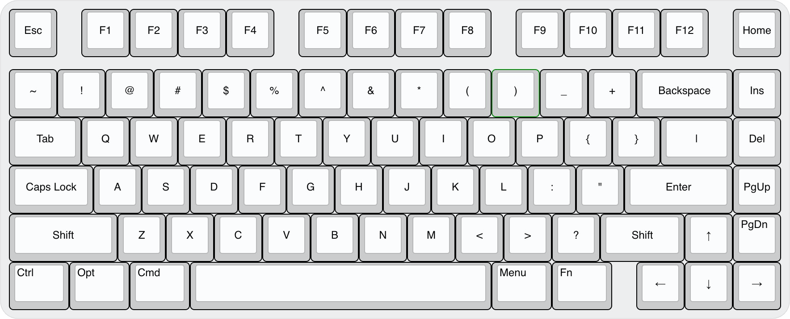

# VR81-Keyboard-PCB

> &#128679; `Placeholder for future project` &#128679;  
> &nbsp; &nbsp; &nbsp; &nbsp; &nbsp; &nbsp; &nbsp; &nbsp; &#9888;&#9888;&#9888;&#9888;&#9888;&#9888;&#9888;&#9888;&#9888;&#9888;  
> &nbsp; &nbsp; &nbsp; &nbsp; &nbsp; &nbsp; &nbsp; &nbsp; &#9888; ***DO NOT BUILD*** &#9888;  
> &nbsp; &nbsp; &nbsp; &nbsp; &nbsp; &nbsp; &nbsp; &nbsp; &#9888;&#9888;&#9888;&#9888;&#9888;&#9888;&#9888;&#9888;&#9888;&#9888;  
> &#128679; `==============================` &#128679;

## Intent

A 81-key keyboard with QMK f/w.

## Layout ideation renders

#### Layout

## Planned Features

- [ ] QMK build
- [ ] MCU *..... all undecided*

&nbsp; &nbsp;

---
Made with :heart: by Vino Rodrigues
